# Emar Offer - End-to-End Proposal Management System

Emar Offer, kurumsal firmaların müşteri, ürün ve teklif süreçlerini uçtan uca (Full-Stack) dijitalleştiren kapsamlı bir Multi-tenant (Çoklu Kiracı)CRM ve teklif yönetim platformudur. Sistem, kod yönetiminin kolaylaştırılması, firmalar arası kusursuz veri izolasyonu ve modüler bir mimari elde edilmesi amacıyla bağımsız **Backend** ve **Frontend** servislerinden oluşmaktadır.

---

Uygulama, kurumsal yazılım standartlarına (Layered & Modular Architecture) uygun şekilde iki parça halinde tasarlanmıştır:

- **`backend/`**: Sistemin veri güvenliğini, iş mantığını, e-posta otomasyonunu ve SQL Server entegrasyonunu yürüten Node.js tabanlı RESTful API servisidir.
- **`frontend/`**: Kullanıcı etkileşimini sağlayan, tek bir kod tabanından hem Web hem de Mobil (Android/iOS) platformlarda çalışan Flutter arayüz uygulamasıdır.

---

## Öne Çıkan Özellikler

- **Multi-tenant (Çoklu Firma) İzolasyonu:** Tek bir veritabanı üzerinde çalışmasına rağmen "Firma Kodu" ve JWT mühürleri sayesinde her firmanın verisini birbirinden %100 gizler ve korur.
- **Kusursuz Responsive UI:** Cihaz ekran genişliğini dinamik ölçen altyapı sayesinde masaüstünde geniş veri tabloları, mobilde ise dikey akışkan kart mimarisi sunar.
- **Dinamik PDF Şablonları ve Varsayılan Atama:** Hazırlanan teklifler anlık olarak PDF formatına dönüştürülür. Şablon rengi, font tipi ve blok sıralaması canlı olarak değiştirilebilir. Sık kullanılan şablonlar "Varsayılan" olarak sabitlenebilir.
- **Gerçek Zamanlı Finansal Hesaplama:** Ürün girişleri esnasında miktar, birim fiyat, iskonto ve KDV oranlarına göre ara toplam ve genel toplamlar anlık hesaplanır.
- **Çoklu Dil Desteği:** Tek bir dokunuşla tekliflerin Türkçe (TR) veya İngilizce (EN) formatta üretilmesi sağlanır.
- **Gelişmiş Entegrasyon ve Otomasyon:** Üretilen PDF teklifler, Node.js (Nodemailer) sunucusu üzerinden müşteriye doğrudan "Ek (Attachment)" olarak e-postalanabilir veya oluşturulan bağlantılarla tek tuşla WhatsApp üzerinden iletilebilir.

---

## Ekran Görüntüleri (Screenshots)

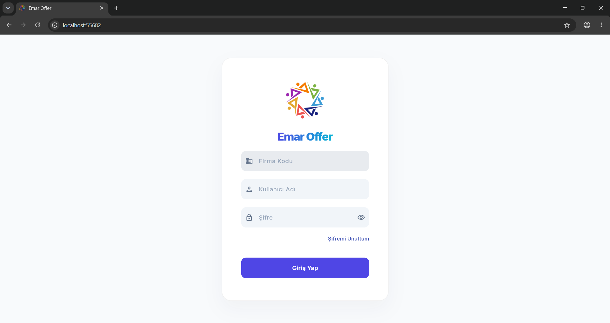
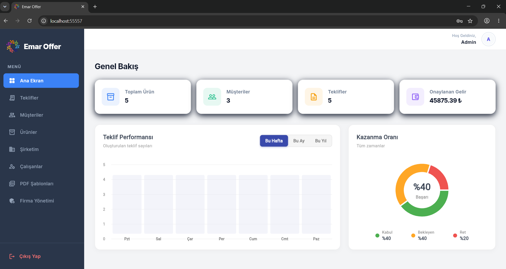
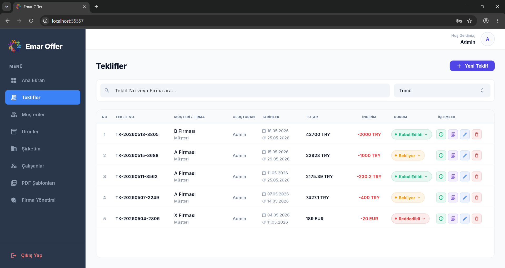
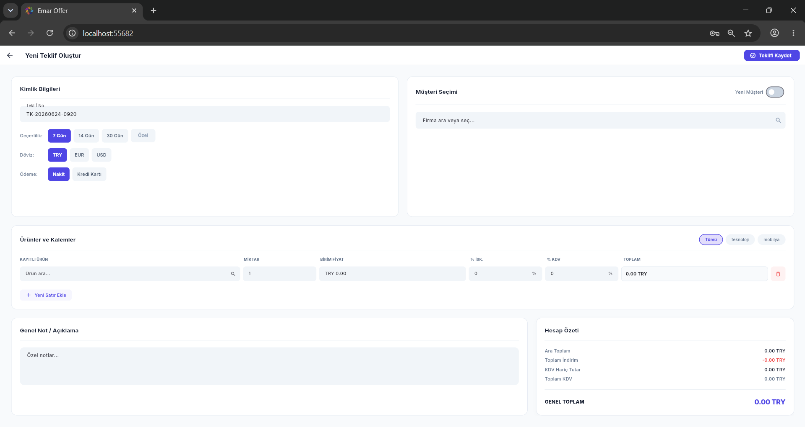
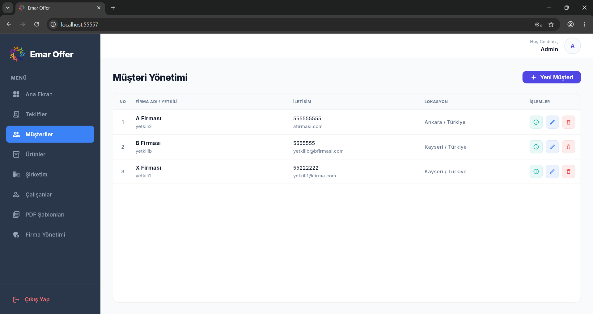
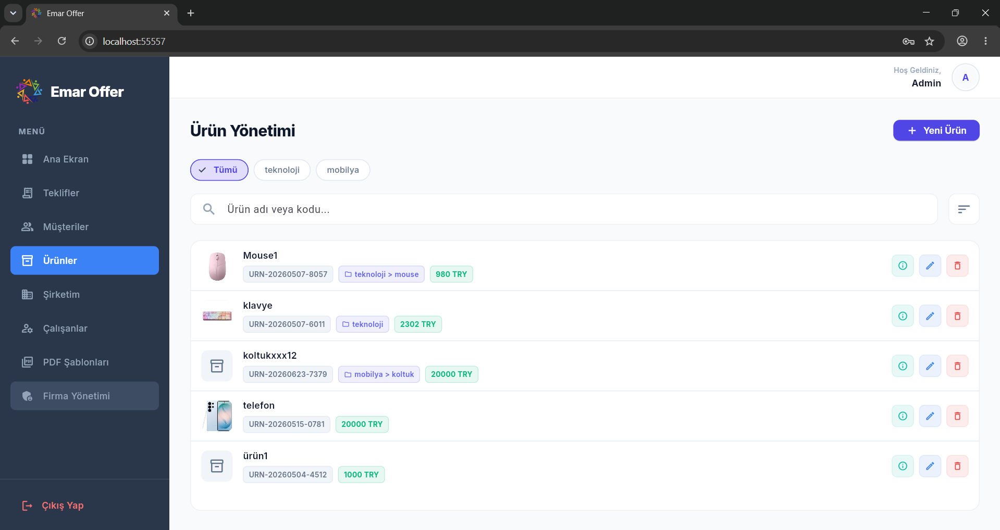
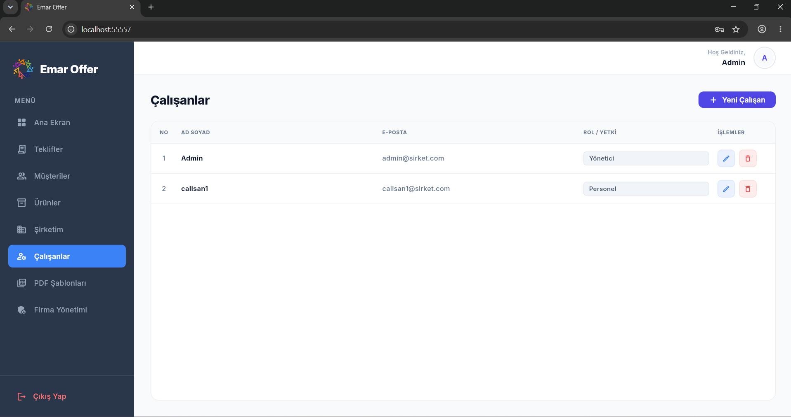
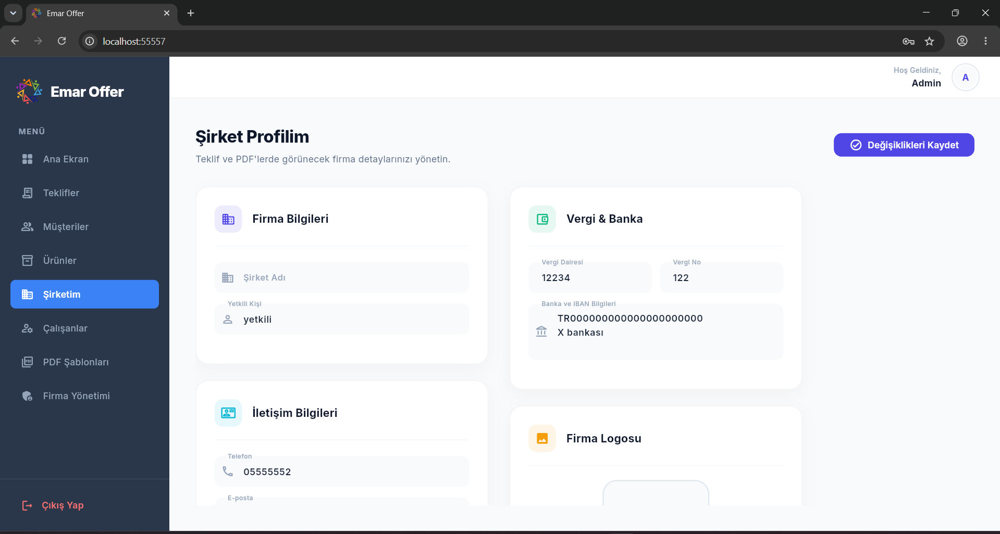
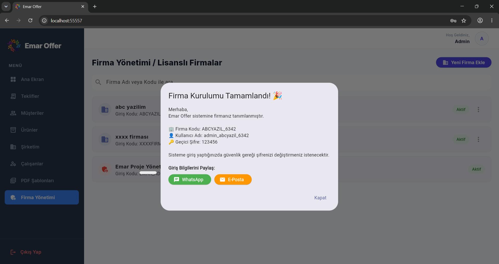

### Canlı PDF Editörü ve Tasarım Yönetimi

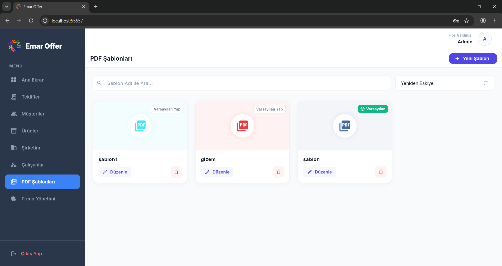
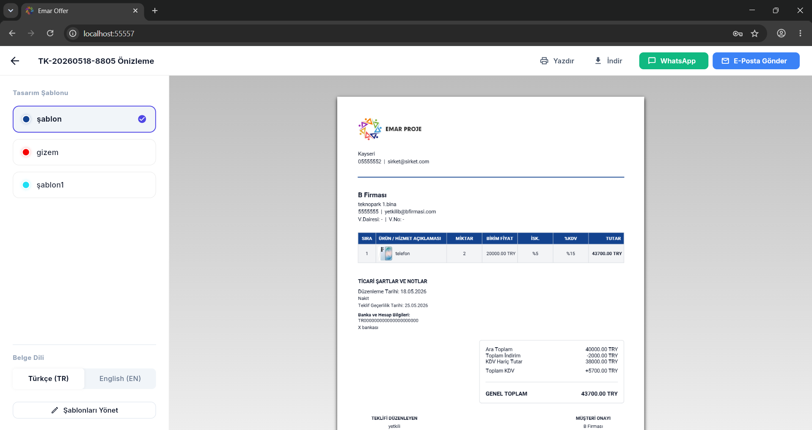

## Hızlı Kurulum (Getting Started)

Sistemi yerel ortamınızda ayağa kaldırmak için sırasıyla aşağıdaki adımları takip edin:

1.  **Veritabanı ve Sunucu:** `backend` dizinine giderek veritabanı bağlantılarını yapılandırın ve API'yi başlatın.
2.  **Kullanıcı Arayüzü:** Sunucu aktif olduktan sonra `frontend` dizinine geçerek Flutter uygulamasını çalıştırın.

Detaylı kurulum adımları alt dizinlerdeki README dosyalarında yer almaktadır.
